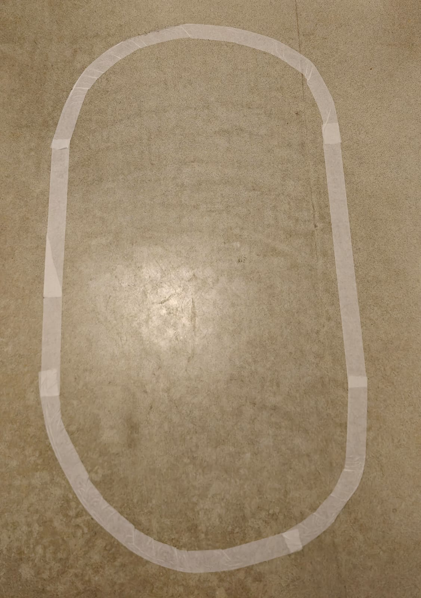
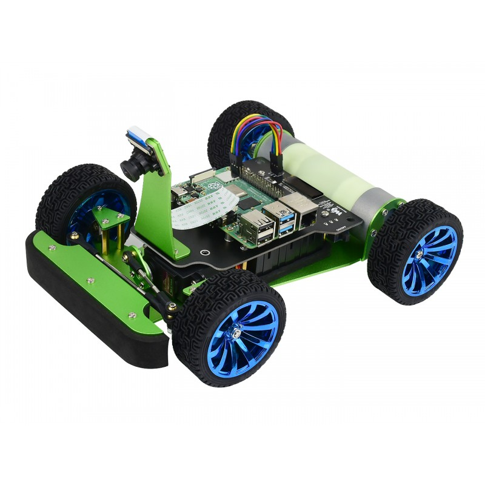

# PiRacer DonkeyCar 🚗

End-to-end autonomous driving system using Raspberry Pi 5 and the DonkeyCar framework.  
This project focuses on improving driving performance using multi-dataset training for lane following, turning, and recovery.

## 🧠 Project Overview
This project implements an autonomous racing car capable of:

- Lane following on a custom indoor track  
- Handling sharp turns  
- Recovering from off-track situations  

The system uses deep learning to predict steering and throttle values from camera input.

## 📂 Dataset Strategy
- `data_center` → normal driving
- `data_turns` → sharp turns
- `data_recovery` → recovery from deviations

## 🏋️ Training
- Model: Keras Linear
- Epochs: ~59
- Multi-dataset training used

## 📊 Results
- Stable lane following achieved
- Baseline model (center-only): unstable at turns
- Multi-dataset model: improved turning and recovery
- Multi-dataset training significantly improved robustness, particularly in turns and recovery scenarios, compared to single-dataset training.
- Final validation loss: ~0.078

## ⚙️ Hardware
- Raspberry Pi 5
- PiCamera
- PiRacer chassis

## ▶️ How to Run

### 🌐 Web Control
- Open the terminal on the Raspberry Pi and run:
  
      cd mycar/
      python manage.py drive
  
- Then open a browser on your host PC and navigate to:
  
      http://<raspberry_pi_ip_address>:8887
  
  You can use any browser (Chrome, Safari, etc.).

For more details, refer to the Web Controller section in the official documentation.

### ⚙️ Calibration
To calibrate steering and throttle:

  - Adjust PWM values to ensure the servo is centered and can turn fully left and right.
    
  - Modify the following parameters in config.py:
    
          STEERING_LEFT_PWM
          STEERING_RIGHT_PWM
          
  - Adjust throttle limits:
    
          JOYSTICK_MAX_THROTTLE
          AI_THROTTLE_MULT
          
For more details, refer to the Calibration section in the official documentation.
      
### 🏋️ Data Transfer & Training
- Transfer dataset from PiRacer to Mac:

          rsync -rv --progress --partial piracer@<your_pi_ip_address>:~/mycar/data/ ~/mycar/data/
  
- Train the model:
  
          python train.py --tub <tub_folder_names_comma_separated> --model models/mypilot.h5
  
- Transfer trained model back to PiRacer:
  
          rsync -rv --progress ~/mycar/models/ piracer@<your_pi_ip_address>:~/mycar/models/

For more details, refer to the Train Data section in the official documentation.

### 🚗 Auto-Driving
- Run the following command on the Raspberry Pi:

      cd mycar/
      python manage.py drive --model ~/mycar/models/mypilot.h5

For more details, refer to the Auto-Driving section in the official documentation.

## 🏁 Track Setup

## 🚗 PiRacer Setup

## 🔗 Reference
This project is built using the PiRacer AI Kit:
https://www.waveshare.com/piracer-ai-kit.htm?srsltid=AfmBOooFl-figGmJj0APjOT1UAlSDXt8R6RpcYDY11cMDYjBhc17iLQ4

Official Documentation:
https://www.waveshare.com/wiki/PiRacer_AI_Kit
