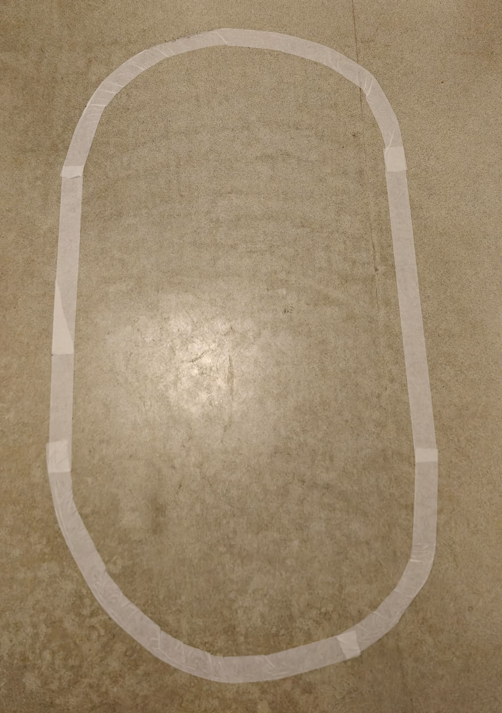
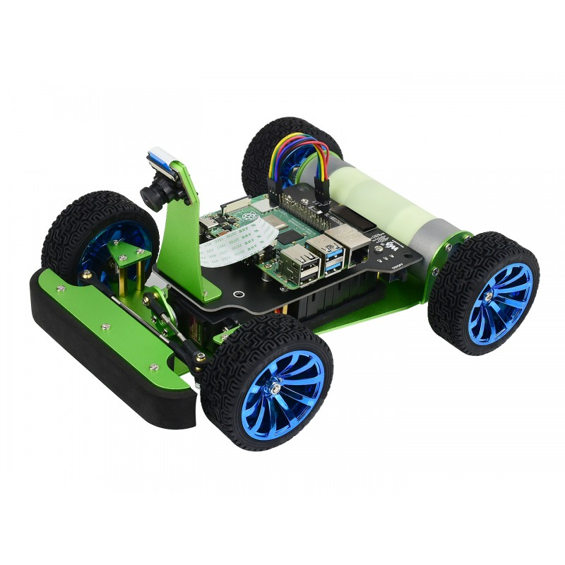

# Deep Learning-Based Autonomous Racing Robot (PiRacer)

End-to-end autonomous driving system using Raspberry Pi 5 and the DonkeyCar framework.  
This project focuses on improving driving performance using multi-dataset training for lane following, turning, and recovery.

## Project Overview
This project implements an autonomous racing car capable of:

- Lane following on a custom indoor track  
- Handling sharp turns  
- Recovering from off-track situations  

The system uses deep learning to predict steering and throttle values from camera input.

---

## Project Context

This project was completed independently under the guidance of a professor at **Westsächsische Hochschule Zwickau (WHZ)**.

I selected the PiRacer autonomous driving project based on my interest in autonomous driving. The project focused on implementing and evaluating an end-to-end autonomous driving system using the DonkeyCar framework on a Raspberry Pi 5–based PiRacer platform.

---

## My Contribution

My contributions to this project included:

- Setting up the PiRacer hardware and Raspberry Pi 5 environment
- Collecting and organizing multiple driving datasets
- Training and evaluating deep learning models using the DonkeyCar framework
- Improving autonomous driving performance through multi-dataset training
- Deploying and validating the trained model on the PiRacer platform

---

## Features

- End-to-end autonomous driving using the DonkeyCar framework
- Deep learning-based steering and throttle prediction
- Multi-dataset model training
- Autonomous lane following
- Turn handling
- Recovery from off-track situations
- Real-time inference on Raspberry Pi 5

---

## Technologies Used

| Technology | Purpose |
|------------|---------|
| Raspberry Pi 5 | Embedded computing platform |
| PiCamera | Image acquisition |
| DonkeyCar | Autonomous driving framework |
| TensorFlow / Keras | Deep learning model training |
| Python | Model training and deployment |
| Linux | Embedded operating system |

---

## Dataset Strategy

Three datasets were collected to improve driving robustness:

- **data_center** – Normal lane-following
- **data_turns** – Sharp turning scenarios
- **data_recovery** – Recovery after leaving the track

The datasets were combined to train a more robust end-to-end driving model.

---

## Training

- Framework: DonkeyCar
- Model: Keras Linear
- Training Epochs: 59
- Training Strategy: Multi-dataset training

---

## Results

Compared with a model trained only on center-lane data, the multi-dataset model demonstrated:

- Improved lane-following stability
- Better performance during sharp turns
- Improved recovery after leaving the track
- Increased overall driving robustness

**Final validation loss:** ~0.078

---

## Hardware

| Hardware | Purpose |
|----------|---------|
| Raspberry Pi 5 | Embedded computing platform |
| PiCamera | Image acquisition |
| PiRacer chassis | Autonomous racing platform |

---

## Experimental Track



**Figure 1:** Indoor track used for autonomous driving experiments.

---

## PiRacer Platform



**Figure 2:** Raspberry Pi 5–based PiRacer autonomous racing platform.

---

## Autonomous Driving Demo

[](https://www.youtube.com/watch?v=GKAPhYXc6sQ)

**Video 1:** Demonstration of autonomous lane following using the trained deep learning model.

---

## Running the Project

The project is executed using the DonkeyCar framework on a Raspberry Pi 5.

Typical workflow:

1. Launch the DonkeyCar web interface.
2. Collect driving data.
3. Train the deep learning model.
4. Deploy the trained model to the PiRacer.
5. Execute autonomous driving using the trained model.

Detailed setup instructions are available in the official DonkeyCar and PiRacer documentation.

---

## Repository Structure

```text
.
├── images/
│   ├── Track.jpeg
│   └── piracer-ai-kit-3.jpg
└── README.md
```
---

## References

- PiRacer AI Kit: https://www.waveshare.com/piracer-ai-kit.htm
- PiRacer AI Kit Documentation: https://www.waveshare.com/wiki/PiRacer_AI_Kit
